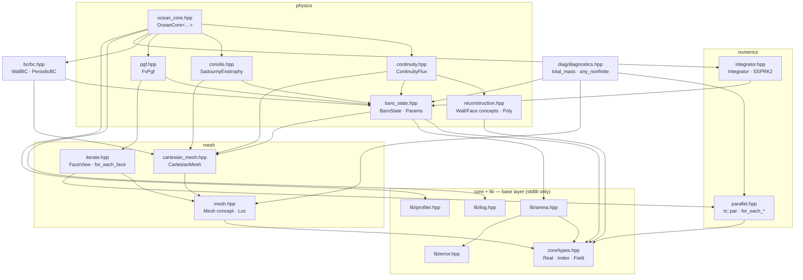
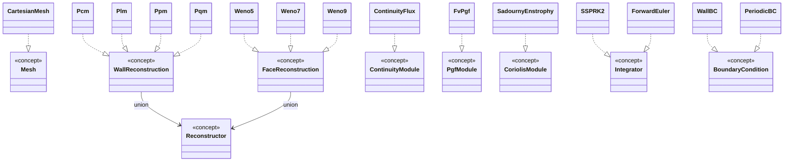
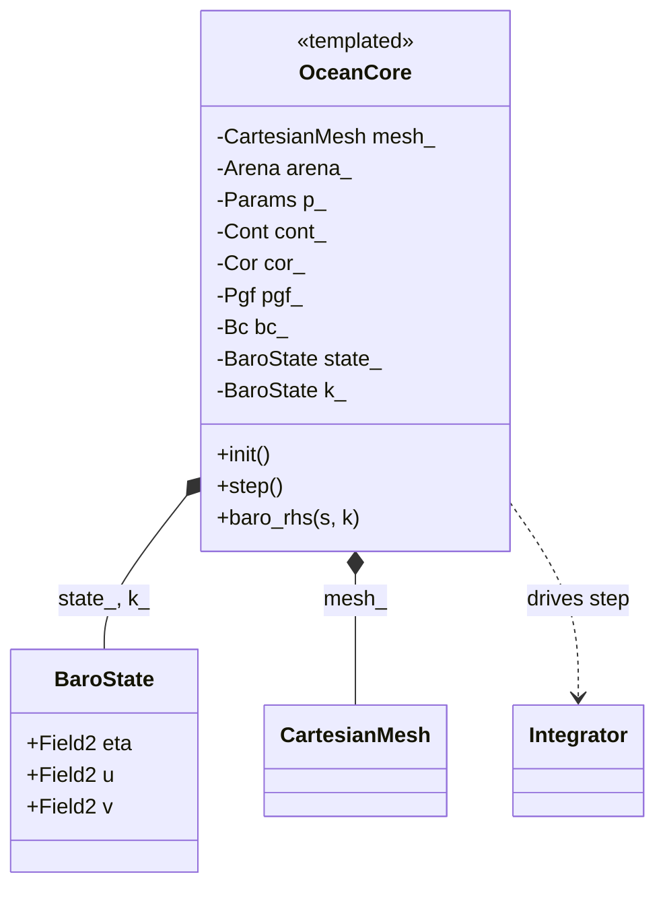
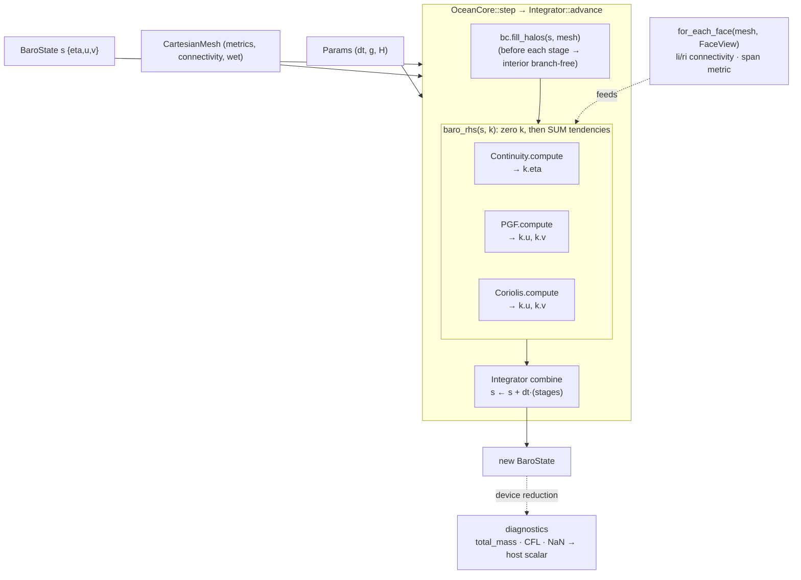

# TurboChook — Architecture Map

How the pieces fit: header dependencies, the concept↔model wiring, the `OceanCore`
composition, and the data flow through one step. Diagrams are **mermaid** (they render
on GitHub and in a Claude artifact). This is the visual companion to
[`DESIGN.md`](DESIGN.md) (the prose spec + ADRs) and [`FOUNDATIONS.md`](FOUNDATIONS.md)
(the directory layout).

**Status legend for the physics:** interfaces (concepts, types, composition) are all
real and type-checked; kernel *bodies* are at mixed maturity — `FvPgf`, the mesh, and
the diagnostics are implemented and tested (host + GPU); `ContinuityFlux`,
`SadournyEnstrophy`, the integrators, and the BCs are M2 stubs behind real signatures.

---

## 1. Header / layer dependency graph

Arrows read **"includes / depends on."** The base layer (`core/types` + `lib/*`) sits
under everything; `ocean_core.hpp` sits on top and pulls the whole stack together.



The **dependency rule** (ADR-7 / FOUNDATIONS): `core/` depends on nothing but the
stdlib; `lib/` on the stdlib + `core/`; everything above on both. Physics modules never
include each other's internals — they meet only inside `ocean_core.hpp`.

---

## 2. Concept ↔ model map

Every policy axis is a **concept** (a compile-time contract); each concrete type
**models** it (`..|>` = "models / satisfies"). Swapping a scheme = swapping a type at
the `OceanCore` instantiation — no inheritance, no vtables.



Notes:
- **`Reconstructor = WallReconstruction ‖ FaceReconstruction`** — a *disjoint* umbrella
  (a scheme is one kind or the other, never both). `ContinuityFlux<Scheme>` constrains on
  `WallReconstruction` (swept flux integrates a `Poly`); WENO's `FaceReconstruction` is
  reserved for the planned tracer-advection consumer.
- `PpmContinuity` is the alias `ContinuityFlux<Ppm>`.
- The module concepts (`ContinuityModule`/`PgfModule`/`CoriolisModule`) are structurally
  the same `{ init; compute(s,k,mesh,p) }` — distinct *names* document each slot's intent.

---

## 3. The composition — `OceanCore` (the god-state)

`OceanCore` is templated on the five policy axes and owns the state + one module per
slot. One line names the whole scheme.



`OceanCore<Cont, Cor, Pgf, Bc, Integ>` — five policy slots. `arena_` is borrowed (one
arena per run). `BaroState` is the staggered C-grid state: `eta` at centres, `u` on
x-faces, `v` on y-faces; `k_` is the RK scratch register. The whole PoC scheme is one
line:

```cpp
using BarotropicPoC = OceanCore<PpmContinuity, SadournyEnstrophy, FvPgf, WallBC, SSPRK2>;
```

---

## 4. Data flow through one step

`step()` hands the state + two host callables (the RHS op and the BC op) to the
integrator. The RHS is a **sum of operator tendencies** accumulated into the scratch
register `k`; the integrator combines stages into the new state. Kernels reach the grid
only through the `FaceView` seam and mesh metrics.



The **boundary** the whole design protects (DESIGN §3): only cheap PODs cross into a
kernel — `Field` views + a `Params` struct, **by value**. No `virtual`, `std::function`,
or captured `this` past this line, or offload breaks. See
[`CPP_PRIMER.md`](CPP_PRIMER.md) for *why* (lambda captures, `mdspan`, concepts).
